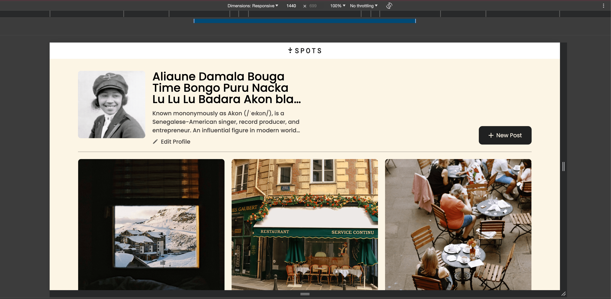
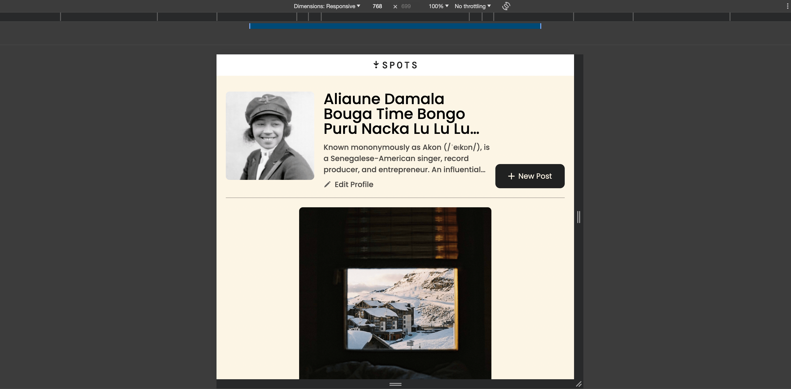
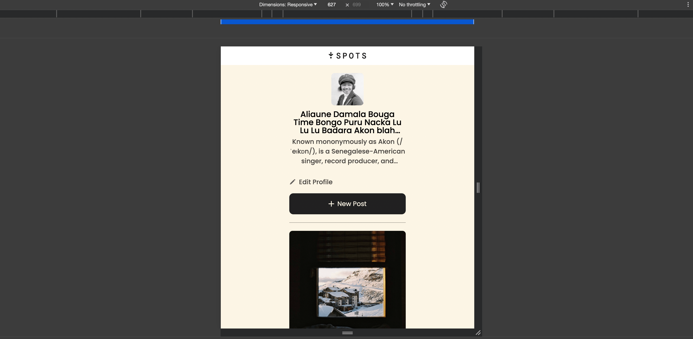

# Project 3: Spots

A responsive web application for discovering unique spots and locations. This project was created as part of a web development course, focusing on using HTML, CSS, and responsive design principles.

### Overview

- Intro
- Figma
- Images

**Intro**

This project is made so all the elements are displayed correctly on popular screen sizes. We recommend investing more time in completing this project, since it's more difficult than previous ones.

**Figma**

- [Link to the project on Figma](https://www.figma.com/file/BBNm2bC3lj8QQMHlnqRsga/Sprint-3-Project-%E2%80%94-Spots?type=design&node-id=2%3A60&mode=design&t=afgNFybdorZO6cQo-1)

**Images**

The way you'll do this at work is by exporting images directly from Figma — we recommend doing that to practice more. Don't forget to optimize them [here](https://tinypng.com/), so your project loads faster.

Good luck and have fun!

**Table of contents**

- Project Overview
- Features
- Technologies Used
- Setup Instructions
- Screenshots
- Live Demo

**Project Overview**

Spots is a static webpage featuring cards for various unique locations. Each card displays a location image, title, and interactive elements. The page is fully responsive, adjusting layouts for desktop, tablet, and mobile screens.

This project focuses on creating a clean and responsive layout using Flexbox and CSS Grid. All components were built with accessibility in mind, ensuring a smooth user experience on all devices.

**Features**

- Responsive Layout: Adjusts to desktop, tablet, and mobile screen sizes.
- Photo Cards: Each card displays an image, title, and description for a location.
- Interactive Elements: Includes hover effects on buttons and links.
- BEM Methodology: Follows BEM conventions for organized CSS and reusability.
- Custom Font and Icons: Uses Poppins font and vector icons for a polished look.

**Technologies Used**

- HTML5: Markup structure and semantic tags.
- CSS3: Styling, Flexbox, and Grid for responsive design.
- JavaScript (optional, if applicable): For interactive features.
- BEM Methodology: Organized CSS structure for easy maintenance.
- Normalize.css: Cross-browser consistency.

**Setup Instructions**

- Clone the Repository: git clone https://github.com/Majestyk1/se_project_spots.git
- Navigate into the Project Folder: cd se_project_spots
- Open index.html in your browser to view the project locally.

**Screenshots**

**Live Demo**
